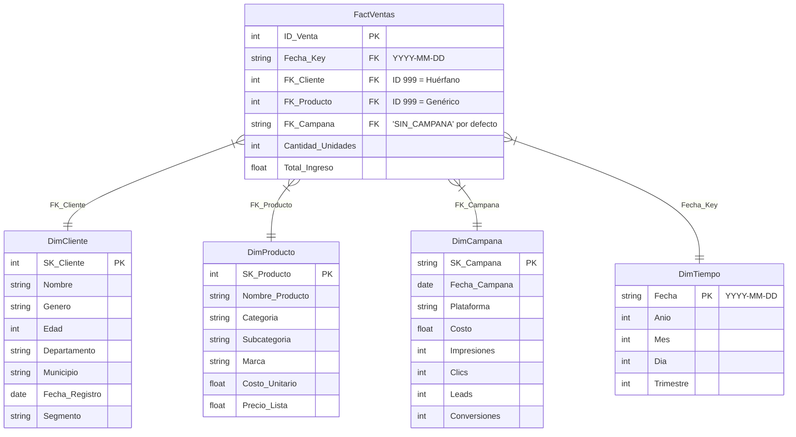

# Modelo Dimensional / Esquema Estrella (Data Warehouse / OLAP)

Este modelo representa la arquitectura de la **Capa Oro** en el Data Warehouse (`dw_ventas.db`). Está optimizado para la lectura rápida, cruce de variables y generación de KPIs gerenciales mediante herramientas de Business Intelligence y SQL.

## Diagrama del Esquema Estrella

## Consideraciones de Arquitectura y Calidad
1. **Unificación de Fechas (`DimTiempo`):** Las fechas dispares provenientes de los CSVs y JSONs han sido estandarizadas al formato `YYYY-MM-DD`. `DimTiempo` actúa como la columna vertebral para medir el ROI cruzando `FactVentas` y `DimCampana`.
2. **Early Arriving Facts (Manejo de Nulos):** Si una venta se registra con un cliente o producto inexistente en los catálogos principales, el pipeline ETL le asigna automáticamente la *Surrogate Key* (SK) `999` para no perder la transacción ni romper la integridad referencial.
3. **Integración de Marketing:** Se generó el identificador `'SIN_CAMPANA'` para las ventas orgánicas que no provienen de un esfuerzo de marketing digital directo, permitiendo un cálculo exacto del Costo de Adquisición (CAC) y el Retorno de Inversión (ROI).