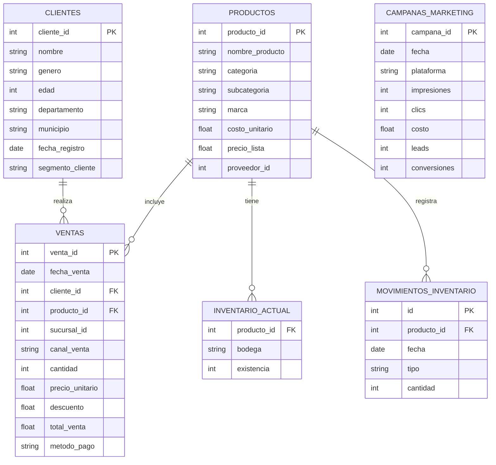

# Modelo Relacional (Sistemas de Origen / OLTP)

Este modelo representa la estructura de los datos tal cual se extraen de las distintas fuentes operacionales de **DataCommerce GT** (Sistemas transaccionales, archivos planos y APIs). Representa la Capa Bronce/Cruda.

## Diagrama Entidad-Relación (Origen)

## Descripción de Fuentes (Data Catalog Crudo)
* **`ventas.csv`**: Tabla transaccional central. Contiene inconsistencias en formatos de fecha.
* **`productos.xlsx`**: Catálogo de productos.
* **`clientes.json`**: Base de datos de clientes con perfiles demográficos.
* **`inventario.db`**: Base de datos SQLite operacional con stock estático (`inventario_actual`) e histórico de flujos (`movimientos_inventario`).
* **`api_marketing_response.json`**: Respuesta de la API REST del equipo de marketing digital. (No relacionada directamente en el origen con ventas).